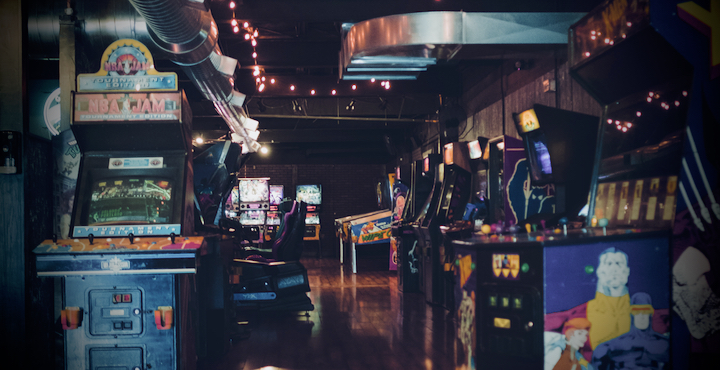

# Morphing Unreal

**Unreal Engine 5** Experiments & gyms for various POCs.

### Cloning
Use cloning with history truncation to avoid pulling all the heavy historical assets:  
```git clone --depth 1 REPO_URL```

<br>

# Projects


## [Arcade](./Arcade/)

#### Arcade is a… TBD



